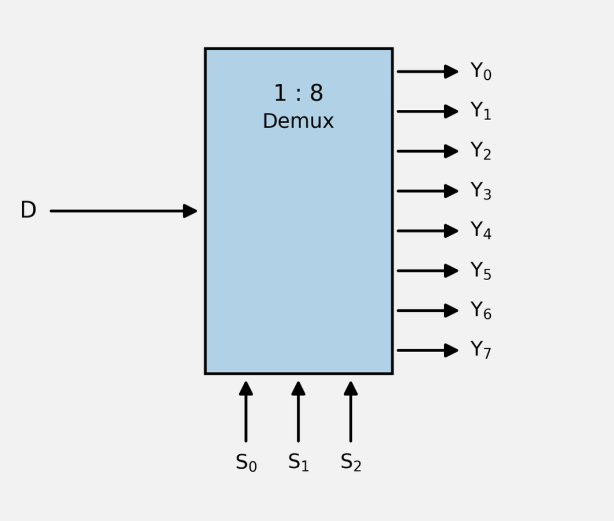
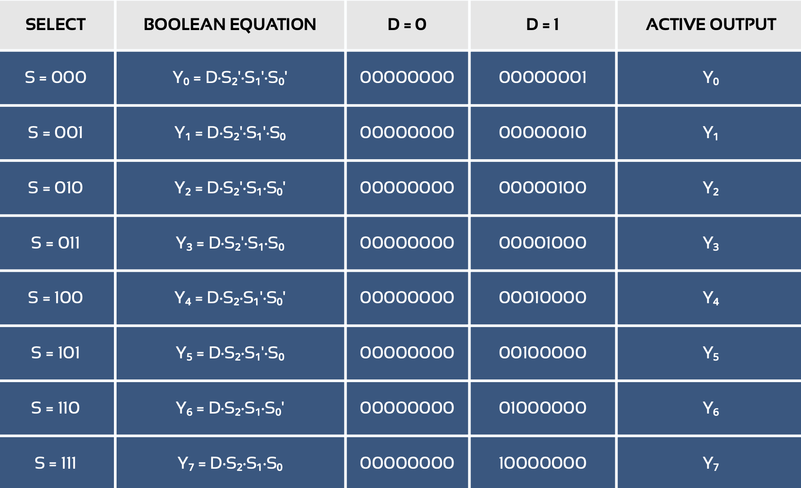
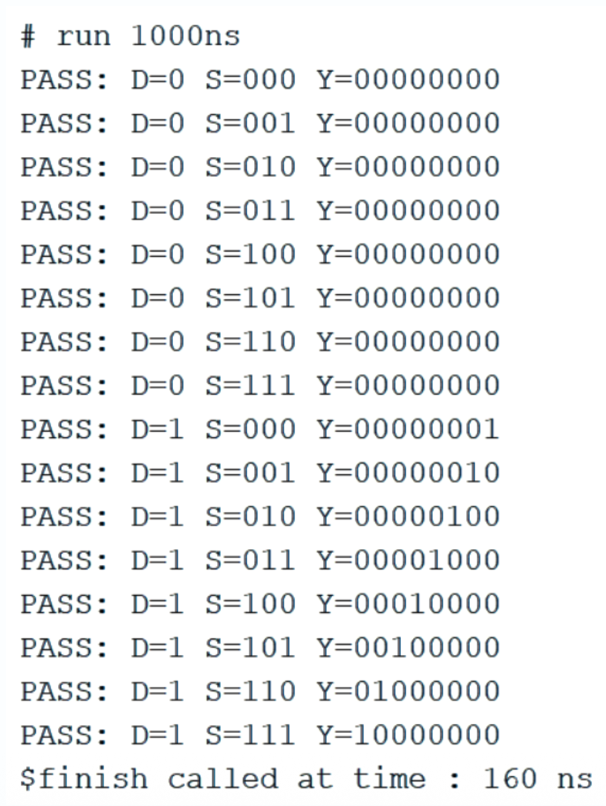

# 1:8 Demultiplexer using Verilog HDL

## Project Overview

This project implements and simulates a **1:8 Demultiplexer (DEMUX)** using **Verilog HDL**.

A demultiplexer takes a single data input and routes it to one of multiple output lines based on the select inputs.

For a 1:8 DEMUX:

- **Data input:** `D`
- **Select input:** `S[2:0]`
- **Outputs:** `Y[7:0]`

Since there are 3 select bits, $2^3 = 8$, so the input `D` can be routed to one of 8 output lines.



---

## Working Principle

The three select inputs `S[2:0]` determine which output receives the data input.

Only one output can carry the value of `D` at a time. All other outputs remain `0`.

### Select Mapping

| Select `S[2:0]` | Selected Output |
|---|---|
| `000` | `Y[0]` |
| `001` | `Y[1]` |
| `010` | `Y[2]` |
| `011` | `Y[3]` |
| `100` | `Y[4]` |
| `101` | `Y[5]` |
| `110` | `Y[6]` |
| `111` | `Y[7]` |

---

## Boolean Expressions

The eight output equations are:

```text
Y0 = D · S2' · S1' · S0'
Y1 = D · S2' · S1' · S0
Y2 = D · S2' · S1  · S0'
Y3 = D · S2' · S1  · S0
Y4 = D · S2  · S1' · S0'
Y5 = D · S2  · S1' · S0
Y6 = D · S2  · S1  · S0'
Y7 = D · S2  · S1  · S0
```

---

## Truth Table

| D | S2 | S1 | S0 | Y7 | Y6 | Y5 | Y4 | Y3 | Y2 | Y1 | Y0 |
|---|----|----|----|----|----|----|----|----|----|----|----|
| 0 | 0 | 0 | 0 | 0 | 0 | 0 | 0 | 0 | 0 | 0 | 0 |
| 0 | 0 | 0 | 1 | 0 | 0 | 0 | 0 | 0 | 0 | 0 | 0 |
| 0 | 0 | 1 | 0 | 0 | 0 | 0 | 0 | 0 | 0 | 0 | 0 |
| 0 | 0 | 1 | 1 | 0 | 0 | 0 | 0 | 0 | 0 | 0 | 0 |
| 0 | 1 | 0 | 0 | 0 | 0 | 0 | 0 | 0 | 0 | 0 | 0 |
| 0 | 1 | 0 | 1 | 0 | 0 | 0 | 0 | 0 | 0 | 0 | 0 |
| 0 | 1 | 1 | 0 | 0 | 0 | 0 | 0 | 0 | 0 | 0 | 0 |
| 0 | 1 | 1 | 1 | 0 | 0 | 0 | 0 | 0 | 0 | 0 | 0 |
| 1 | 0 | 0 | 0 | 0 | 0 | 0 | 0 | 0 | 0 | 0 | 1 |
| 1 | 0 | 0 | 1 | 0 | 0 | 0 | 0 | 0 | 0 | 1 | 0 |
| 1 | 0 | 1 | 0 | 0 | 0 | 0 | 0 | 0 | 1 | 0 | 0 |
| 1 | 0 | 1 | 1 | 0 | 0 | 0 | 0 | 1 | 0 | 0 | 0 |
| 1 | 1 | 0 | 0 | 0 | 0 | 0 | 1 | 0 | 0 | 0 | 0 |
| 1 | 1 | 0 | 1 | 0 | 0 | 1 | 0 | 0 | 0 | 0 | 0 |
| 1 | 1 | 1 | 0 | 0 | 1 | 0 | 0 | 0 | 0 | 0 | 0 |
| 1 | 1 | 1 | 1 | 1 | 0 | 0 | 0 | 0 | 0 | 0 | 0 |



---

## Verilog Implementation

The DEMUX is implemented using a combinational `always` block and a `case` statement.

```verilog
module demux_1to8(
    input D,
    input [2:0] S,
    output reg [7:0] Y
);

always @(*) begin
    Y = 8'b00000000;
    case (S)
        3'b000: Y[0] = D;
        3'b001: Y[1] = D;
        3'b010: Y[2] = D;
        3'b011: Y[3] = D;
        3'b100: Y[4] = D;
        3'b101: Y[5] = D;
        3'b110: Y[6] = D;
        3'b111: Y[7] = D;
    endcase
end

endmodule
```

---

## Testbench

The testbench checks all 8 possible select combinations for both values of `D`.

```verilog
module demux_tb;

    reg D;
    reg [2:0] S;
    wire [7:0] Y;
    reg [7:0] expected;
    integer i;

    demux_1to8 dut (
        .D(D),
        .S(S),
        .Y(Y)
    );

    initial begin
        D = 0;
        for (i = 0; i < 8; i = i + 1) begin
            S = i;
            expected = 8'b00000000;
            #10;
            if (Y == expected)
                $display("PASS: D=%b S=%b Y=%b", D, S, Y);
            else
                $display("FAIL: D=%b S=%b Expected=%b Actual=%b",
                         D, S, expected, Y);
        end

        D = 1;
        for (i = 0; i < 8; i = i + 1) begin
            S = i;
            expected = 8'b00000000;
            expected[i] = 1'b1;
            #10;
            if (Y == expected)
                $display("PASS: D=%b S=%b Y=%b", D, S, Y);
            else
                $display("FAIL: D=%b S=%b Expected=%b Actual=%b",
                         D, S, expected, Y);
        end

        $finish;
    end

endmodule
```

---

## Simulation Verification

### D = 0

For every select combination from `000` to `111`:

```text
Y = 00000000
```

### D = 1

For every select combination, the corresponding output becomes `1`.

For example:

```text
S = 011
Y = 00001000
```

Here, `S = 011` selects `Y[3]`, so the input `D = 1` is routed to `Y[3]`.

The testbench automatically generates the expected output and compares it with the actual output. A `PASS` message is displayed when the expected and actual outputs match. Otherwise, a `FAIL` message is displayed.

### Waveform


### Tcl Console Output



---

## Project Files

```text
demux_1to8_verilog/
│
├── src/
│   └── demux_1to8.v
│
├── testbench/
│   └── demux_tb.v
│
├── docs/
│   ├── block_diagram.png
│   ├── truth_table.png
│   ├── waveform.png
│   ├── tcl_console.png
│   └── 18 demux project presentation.pdf
│
├── .gitignore
└── README.md
```

📄 [Project presentation (PDF)](docs/18%20demux%20project%20presentation.pdf)

---

## Tools Used

- **Verilog HDL** — Hardware description language
- **Vivado** — Simulation and verification
- **Visual Studio Code** — Source-code editing
- **Git & GitHub** — Version control and project hosting

---

## Project Outcome

The 1:8 demultiplexer was successfully implemented in Verilog HDL and verified through simulation.

The testbench tested:

- All 8 possible select combinations
- `D = 0`
- `D = 1`
- Correct routing of the input to the selected output
- All non-selected outputs remaining `0`

The simulation results confirm the expected functionality of the 1:8 DEMUX.