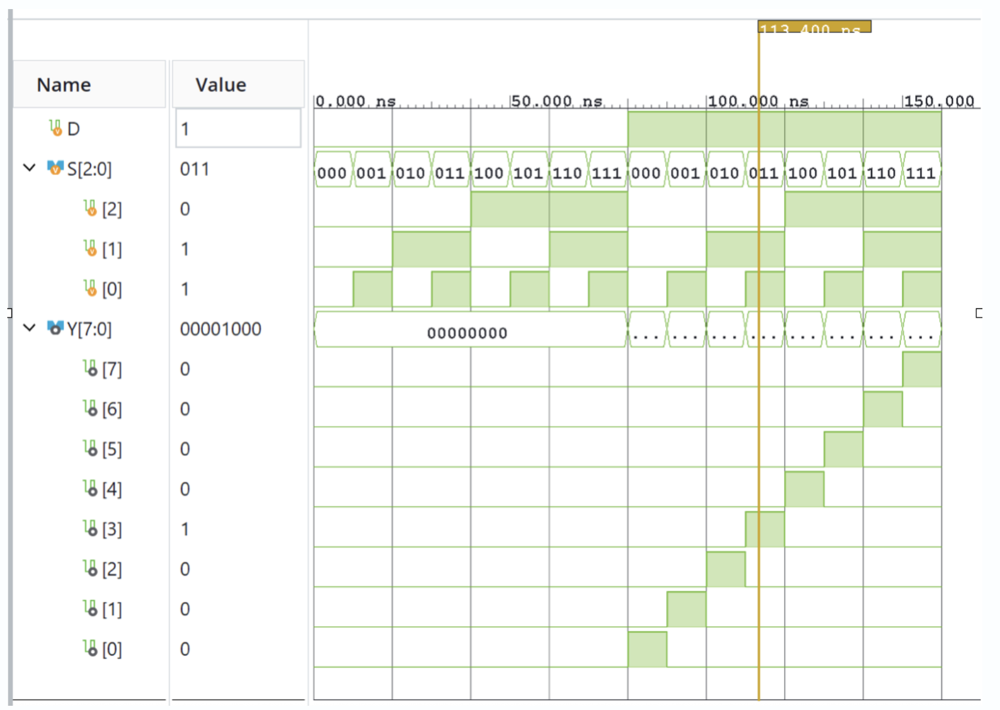

# 1:8 Demultiplexer Using Verilog HDL

## Project Overview

This project implements and simulates a 1:8 Demultiplexer using Verilog HDL.

A demultiplexer routes a single data input to one of multiple output lines based on the select input.

For this 1:8 demultiplexer:

- Data input: D
- Select input: S[2:0]
- Output: Y[7:0]

The three select bits provide 2^3 = 8 possible output selections.

## Inputs and Outputs

| Signal | Width | Description |
|--------|-------|-------------|
| D | 1 bit | Data input |
| S[2:0] | 3 bits | Select input |
| Y[7:0] | 8 bits | Output lines |

## Working Principle

The select input S[2:0] determines which output receives the data input D.

| Select | Active Output |
|--------|---------------|
| 000 | Y0 |
| 001 | Y1 |
| 010 | Y2 |
| 011 | Y3 |
| 100 | Y4 |
| 101 | Y5 |
| 110 | Y6 |
| 111 | Y7 |

When D = 0, all outputs are 0 regardless of the select input.

When D = 1, the output selected by S[2:0] becomes 1 while all other outputs remain 0.

## Boolean Equations

Y0 = D · S2' · S1' · S0'

Y1 = D · S2' · S1' · S0

Y2 = D · S2' · S1 · S0'

Y3 = D · S2' · S1 · S0

Y4 = D · S2 · S1' · S0'

Y5 = D · S2 · S1' · S0

Y6 = D · S2 · S1 · S0'

Y7 = D · S2 · S1 · S0

## Verilog Implementation

The demultiplexer is implemented using a combinational `always @(*)` block and a `case` statement based on the 3-bit select input S[2:0].

The outputs are first initialized to zero. The selected output is then assigned the value of D.

## Testbench

The testbench verifies all eight possible select combinations for two cases.

### D = 0

For every select combination from 000 to 111:

Y = 00000000

### D = 1

For every select combination, the corresponding output is expected to become 1.

For example:

S = 011
Y = 00001000

The testbench automatically generates the expected output and compares it with the actual output.

A `PASS` message is displayed when the expected and actual outputs match. Otherwise, a `FAIL` message is displayed.

## Simulation Results

The design was verified using behavioral simulation in AMD Vivado.

The waveform demonstrates that the selected output follows the input D while all other outputs remain inactive.



## Project Files

```text
demux_1to8_verilog/
├── README.md
├── .gitignore
├── src/
│   └── demux_1to8.v
├── testbench/
│   └── demux_tb.v
└── docs/
    ├── waveform.png
    ├── block_diagram.png
    ├── truth_table.png
    ├── tcl_console.png
    └── 18 demux project presentation.pdf
```text

## Tools Used

- Verilog HDL
- AMD Vivado
- Vivado XSim behavioral simulation

## How to Run

1. Open AMD Vivado.
2. Create a new RTL project.
3. Add `src/demux_1to8.v` as a Design Source.
4. Add `testbench/demux_tb.v` as a Simulation Source.
5. Set `demux_tb` as the simulation top module.
6. Run Behavioral Simulation.
7. Add `D`, `S[2:0]`, and `Y[7:0]` to the waveform.
8. Run the simulation and verify the outputs.

## Result

The 1:8 demultiplexer successfully routes the input data to the output selected by `S[2:0]`.

The testbench verifies all eight select combinations for both `D = 0` and `D = 1`.